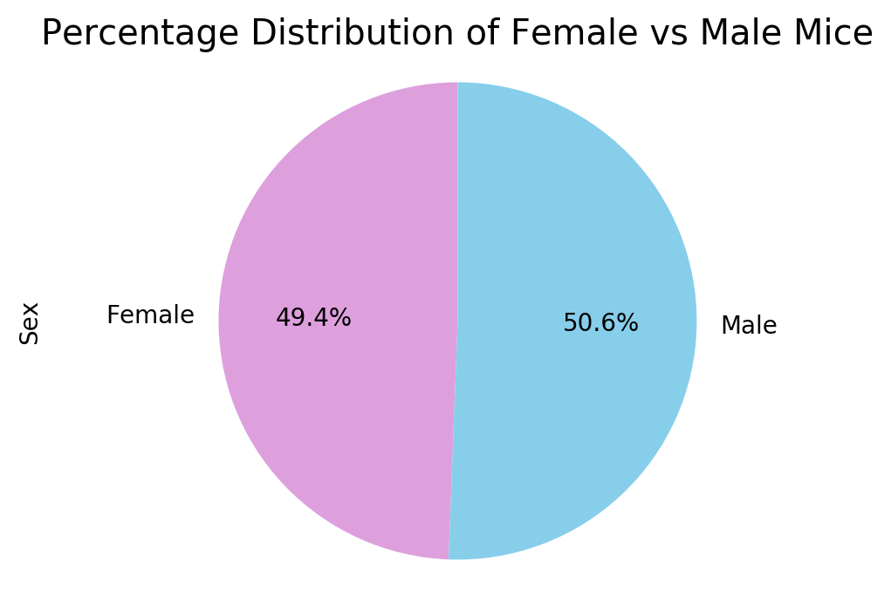
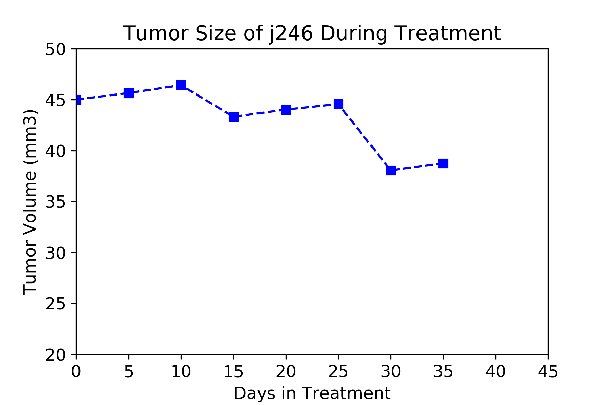
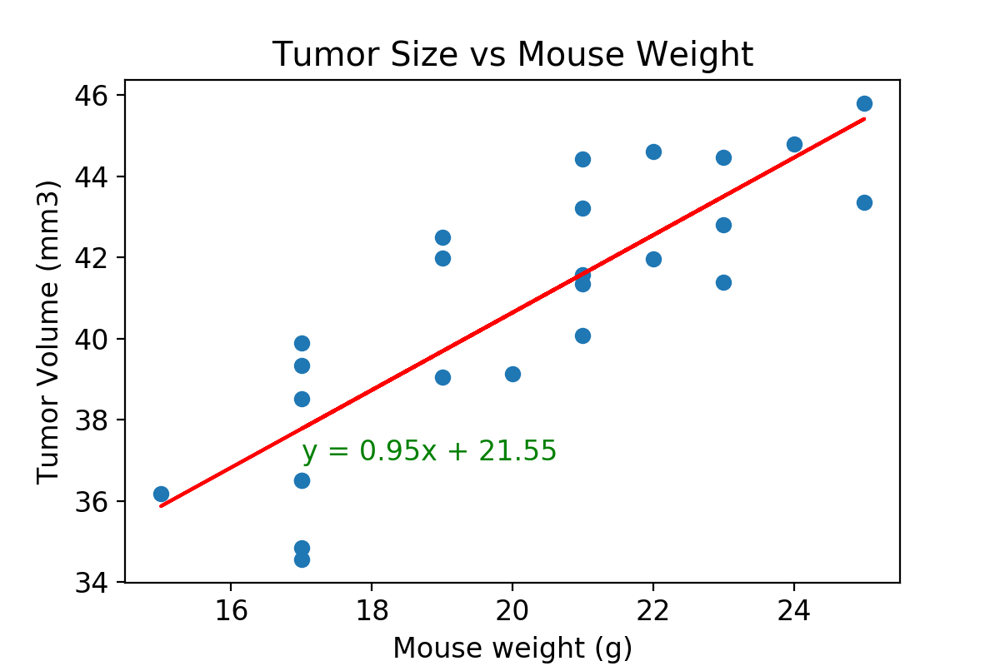

# Matplotlib Homework - The Power of Plots

## Bar Charts

* Generate a summary statistics table consisting of the mean, median, variance, standard deviation, and SEM of the tumor volume for each drug regimen.

* Generate a bar plot using both Pandas's `DataFrame.plot()` and Matplotlib's `pyplot` that shows the number of data points for each treatment regimen.

  * **NOTE:** These plots should look identical.

## Pie Charts (Sean's favorite!)

* Generate a pie plot using both Pandas's `DataFrame.plot()` and Matplotlib's `pyplot` that shows the distribution of female or male mice in the study.
  * **NOTE:** These plots should look identical.

## IQR

* Calculate the final tumor volume of each mouse across four of the most promising treatment regimens: Capomulin, Ramicane, Infubinol, and Ceftamin. Calculate the quartiles and IQR and quantitatively determine if there are any potential outliers across all four treatment regimens.

Capomulin data:
IQR: 7.78
Lower quartile: 32.38
Upper quartile: 40.16
Median: 38.12 
Potential outliers for Capomulin are any values below 20.71 and above 51.83.
---------------------------
Ramicane data:
IQR: 9.1
Lower quartile: 31.56
Upper quartile: 40.66
Median: 36.56 
Potential outliers for Ramicane are any values below 17.91 and above 54.31.
---------------------------
Infubinol data:
IQR: 11.48
Lower quartile: 54.05
Upper quartile: 65.53
Median: 60.16 
Potential outliers for Infubinol are any values below 36.83 and above 82.75.
---------------------------
Ceftamin data:
IQR: 15.58
Lower quartile: 48.72
Upper quartile: 64.3
Median: 59.85 
Potential outliers for Ceftamin are any values below 25.35 and above 87.67.
--------

* Using Matplotlib, generate a box and whisker plot of the final tumor volume for all four treatment regimens and highlight any potential outliers in the plot by changing their color and style.

  

* Generate a line plot of time point versus tumor volume for a single mouse treated with Capomulin.

 

* Generate a scatter plot of mouse weight versus average tumor volume for the Capomulin treatment regimen.

 

* Calculate the correlation coefficient and linear regression model between mouse weight and average tumor volume for the Capomulin treatment. Plot the linear regression model on top of the previous scatter plot.

 

## Observations

* Look across all previously generated figures and tables and write at least three observations or inferences that can be made from the data. Include these observations at the top of notebook.

1 - The sex of the test subjects was distrubted fairly even with 50.6% male and 49.4% female. 

2 - Treatment drugs Capomulin and Ramicane had the best reduction, therefore showing the most promising results.

3 - The correlation between Mouse Weight and Average Tumor Volume is 0.84, which is quite high. This means they both have a strong relationship with each other (i.e. as weight increases the tumor growth is higher). This is also evident from the linear regression (y=0.95x+21.55). This shows that tumor volume increases by more that 21.

